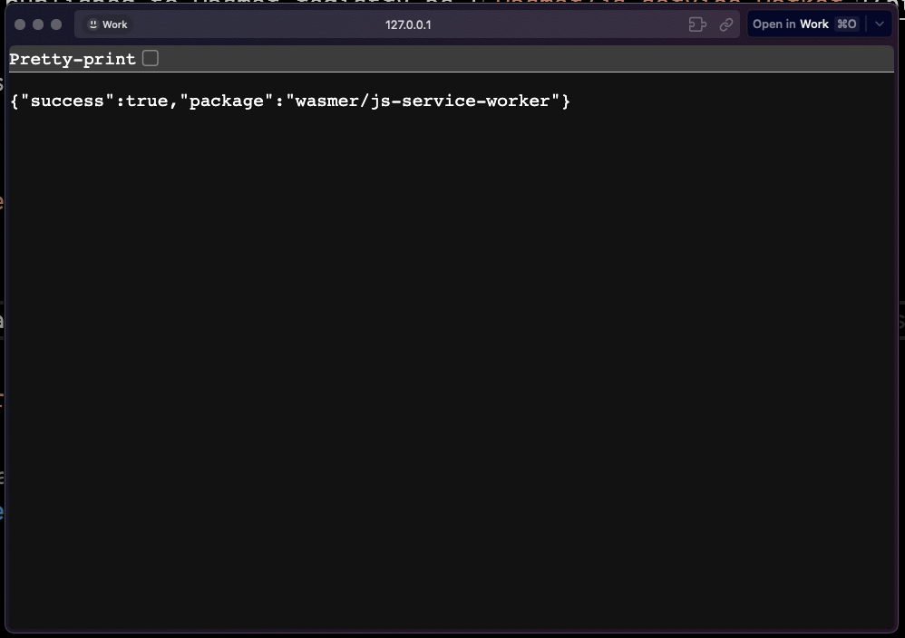

# Sample JavaScript Service Worker with Wasmer

This is a sample repo for running a JavaScript based Service Worker on Wasmer Edge.

Follow the quickstart guide on [Wasmer Docs](https://docs.wasmer.io/edge/quickstart/js-wintercg)

## Running it locally

1. Clone the repo
2. Run it locally using the command below:

```shell
wasmer run . --net
```

> This would start an http server on `http://127.0.0.1:8080`

## Running it using wasmer registry

This package is published to wasmer registry as [`wasmer/js-service-worker`](https://wasmer.io/wasmer/js-service-worker)

You can try this locally.

```shell
wasmer run wasmer/js-service-worker --net
```

> This would start an http server on `http://127.0.0.1:8080`



## Live on Wasmer Edge

```shell
  App Info
> App Name: wasmer-js-service-worker-worker
> App URL: https://wasmer-js-service-worker-worker.wasmer.app
```
